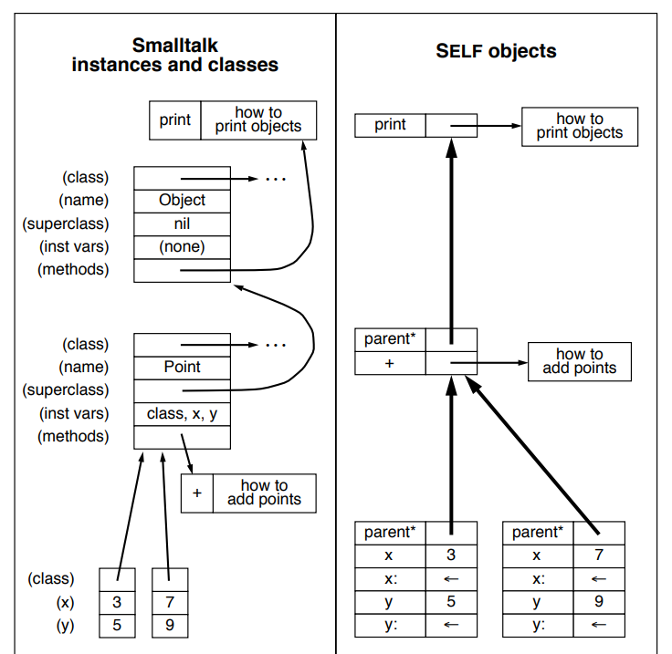

# Prototype

프로토타입은 무엇일까? 자바스크립트에서 프로토타입을 어떻게 다루고 있는지에 대해서 정리해보자.

> JavaScript is a **prototype-based**, multi-paradigm, single-threaded, dynamic language, supporting object-oriented, imperative, and declarative (e.g. functional programming) styles.

[출처](https://developer.mozilla.org/en-US/docs/Web/JavaScript)

자바스크립트는 프로토타입 기반의 멀티 패러다임 언어이다. 자바스크립트에서는 무슨 일을 하는지 알아보기 전에 기본 개념들 몇개를 이야기 해본다.

# Object-oriented Paradigm

객체지향 프로그래밍 패러다임은 Smalltalk에서 시작되었으며 대다수의 언어들은 클래스 기반 객체지향 프로그래밍 언어이기도 하다. 그렇지만 클래스 말고도 객체지향 프로그래밍 패러다임을 구현하려고 한 것이 프로토타입 기반의 언어이다.

# Prototype and SELF

프로토타입 기반의 언어는 [SELF](<https://en.wikipedia.org/wiki/Self_(programming_language)>)에서 시작했다. 이 언어에 대한 논문에서 Smalltalk의 클래스와 비교하는 내용을 보자.



[출처](https://bibliography.selflanguage.org/_static/self-power.pdf)

프로토타입 기반의 SELF는 논문에서 Smalltalk와 비교했을 때 단순하다는 것을 강점으로 내세운다. 클래스 기반의 Smalltalk는 클래스 자체를 위한 또다른 객체가 필요하기 때문에 복잡하지만, SELF는 단순히 객체 사이의 prototype 관계를 갖는 것으로 끝난다는 이야기이다. 좀 더 자세한 사항은 논문을 읽어보면 좋겠다.

# Prototype in JavaScript

[ECMAScript 2021 Language Specification#Objects](https://262.ecma-international.org/12.0/#sec-objects)

해당 링크의 내용도 읽어보면 좋다. 간단히 요약하면 JavaScript는 비록 class 문법을 지원하지만, 기본적으로 prototype 기반의 객체를 구현한다는 내용이다. 이제 이에 대해서 자세히 알아보자.

# 객체 생성 방법

JavaScript에서 객체를 생성하는 방법은 여러가지이다. 정리해보면 크게 다음 세 가지로 정리할 수 있다.

- 객체 리터럴 `{}`를 이용하여 생성
- `new` 생성자 함수를 이용하여 생성
- `Object.create()`을 이용하여 생성

```javascript
const crong = {
  name: 'crong',
}; // 객체 리터럴을 이용한 방법
const Person = function (name) {
  this.name = name;
};
const honux = new Person('honux'); // 생성자 함수를 이용한 방법
const jk = Object.create(Object.prototype, { name: { value: 'jk' } }); // Object.create(proto[, propertiesObject])를 이용
```

# 생성자 함수에 의한 객체 생성

```javascript
const Person = function (name) {
  this.name = name;
};
const honux = new Person('honux');

console.log(honux.constructor === Person); //true
console.log(honux.hasOwnProperty('constructor')); //fasle
```

위의 예제에서, Person은 함수이다. 그리고 honux를 Person이라는 생성자 함수와 `new` 표현식을 이용해서 생성했다. 이때 honux.constructor를 보자.
constructor는 단어의 의미로 해당 객체를 생성한 객체라고 할 수 있겠다. 그래서 그것과 Person을 비교하면 결과가 true가 나온다.

근데 Person을 정의할 때의 코드는 name만을 정의했다. (this 에 대해서는 이 페이지에서 다루지 않는다. 일단, 기존 클래스 기반 언어와 비슷하게 생성될 객체를 가리키는 것이라고 생각하자) 그렇다면 `honux.constructor`는 어디에서 온 것일까?

```javascript
console.log(Person.prototype);
console.log(Person.prototype.constructor === Person); // true
```

`Person`가 함수인 것은 변함이 없다. 근데 `function() {}` 표현식을 이용해서 함수를 생성하면, 이 함수에는 `prototype` 이라는 속성이 존재한다. 이 객체는 `constructor`를 갖는데, 이것은 `Person`과 동일하다.

```javascript
console.log(honux.__proto__ === Person.prototype); //true
```

honux에서 접근할 수 있는 특수한 속성이 있는데 `__proto__` 이다. 그리고 이 속성은 `Person.prototype` 과 같다.

```javascript
Person.prototype.hello = function () {
  console.log(`Hello! I'm ${this.name}!`);
};

honux.hello(); // Hello! I'm honux!
honux.hasOwnProperty('hello'); // false
```

`Person.prototype`에 `hello` 라는 함수를 추가해보자. 그리고 honux에서 이를 실행하면, 정의한 대로 실행이 되지만, honux 자체가 여전히 해당 속성을 가지고 있지 않는다.

이는 생성자 함수를 이용하여 객체를 생성하면 그 객체의 `__proto__`는 해당 함수의 `prototype`을 갖는다. 그리고 생성한 객체에서 어떤 속성에 접근할 때, 해당 객체가 속성을 가지고 있지 않으면, `__proto__`로 가서 또 해당 속성을 찾아 접근한다. 이런 구조를 프로토타입 체인 (Prototype chain)이라고 한다.

그러면 다음을 생각해볼 수 있겠다.

> Person은 honux의 프로토타입인 것 같다. 그러면, Person의 프로토타입은 뭘까?

```javascript
console.log(Object.getPrototypeOf(Person.prototype) === Object.prototype); // true
console.log(Object.getPrototypeOf(Object.prototype)); // null
```

여기서는 `Person.prototype.__proto__` 대신 `Object.getPrototypeOf()`를 이용했다. 이 두개는 같은 동작을 한다. 그래서, Person의 프로토타입은 Object라고 할 수 있겠다. 그리고 Object의 프로토타입은 null로 존재하지 않는다. 이를 이용해서 유추할 수 있는 사실은 다음과 같다.

> honux -> Person -> Object 와 같은 객체의 계층 구조를 가진다. 즉, 프로토타입 체인의 끝은 Object가 된다.

# prototype을 이용한 상속 구현

[참고 링크1](https://developer.mozilla.org/en-US/docs/Learn/JavaScript/Objects/Inheritance)

[참고 링크2](https://developer.mozilla.org/en-US/docs/Web/JavaScript/Inheritance_and_the_prototype_chain#different_ways_to_create_objects_and_the_resulting_prototype_chain)

현재 예제에서 Master를 구현한다고 해보자. 이는 Person을 프로토타입으로 갖고, 추가로 가르치는 과목에 대한 속성을 갖는다.

```javascript
const Master = function (name, subject) {
  Person.call(this, name); // Person 함수를 부를 때, this를 전달한다.
  this.subject = subejct;
};
const crong = new Master('crong', 'frontend');

console.log(crong.hasOwnProperty('name')); // true
console.log(crong.hasOwnProperty('subject')); // true
```

Master 내부 생성자 함수에서는 Person 함수를 부를 때 this를 넘겨서 실행하면, 생성될 객체에 해당 속성을 추가한다. 그래서 생성된 객체는 `name`과 `subject` 속성을 자신이 직접 가지고 있다.

그런데 이 상태에서는 Person의 hello는 사용할 수 없다. 이유는 `Master.prototype`에는 처음 Person을 만들었을 때와 비슷하게 constructor만 존재하며, `__proto__`는 Object.prototype이기 때문이다. 그래서 Master.prototype과 Person.prototype을 어떤 방법을 통해서 연결해야한다.

```javascript
let MasterPrototype = Object.create(Person.prototype);
MasterPrototype.constructor = Master;
Master.prototype = MasterPrototype;
```

- 먼저 `Object.create(prototype)`를 이용하여 새 객체를 생성한다. 이때 속성은 추가하지 않는다.
- `Person`을 처음 만들었을 때를 생각해보자. 이 때 `Person.prototype.constructor === Person` 였다.
- `Object.create(prototype)` 으로 만든 객체에 같은 구조를 갖게 하기 위해서 `constructor = Master`를 할당한다.
- 그리고 Master.prototype에 새로 생성한 객체를 할당한다.

이제, 이를 깔끔하게 정리해보자

```javascript
Master.prototype = Object.create(Person.prototype);
Master.prototype.constructor = Master;
```

Object.create()가 이해가 안된다면, 다음과 같이 사용해도 동작한다.

```javascript
Master.prototype = new Person(); // 해당 객체는 name이 undefined로 존재한다.
Master.prototype.constructor = Master;

const crong = new Master('crong', 'frontend');
crong.hello();
```

SELF에서 이야기 했던 것처럼, JavaScript의 prototype 기반의 상속 구현은 단순히 객체 사이의 참조 관계이다.

[참고 링크2](https://developer.mozilla.org/en-US/docs/Web/JavaScript/Inheritance_and_the_prototype_chain#different_ways_to_create_objects_and_the_resulting_prototype_chain) 에서 다양한 방법으로 상속을 구현하는 예제와 장단점을 볼 수 있다. 핵심은 모두 비슷하다.

# class

ECMAScript 2015 부터 여타 클래스 기반 언어와 마찬가지로 class를 이용하여 객체를 정의하고 사용할 수 있다.

```javascript
class Person {
  constructor(name) {
    this.name = name;
  }

  hello() {
    ...
  }
}

class Master extends Person {
  constructor(name, subject) {
    super(name);
    this.subject = subject;
  }

  hello() {
    ...
  }
}
```

특이점으로는 해당 객체의 함수를 메소드로 선언할 수 있다.

# 생성자 함수가 아닌 함수들

[참고 링크](https://262.ecma-international.org/12.0/#sec-function-instances-prototype)

Function.prototype.bind나 class 내에서 메소드로 선언한 함수, 그리고 화살표 함수는 prototype 을 갖지 않는다. 그래서 이를 이용하여 객체를 생성할 수 없다.

# 정적 속성

static도 별 것 없다. 생성자 함수 또한 객체이기 때문에 속성을 직접 정의하면, 해당 객체의 정적 속성들을 정의할 수 있다.

```javascript
Master.company = 'Codesquad';
```

# 정리

결국 프로토타입은 객체지향 패러다임을 구현하는 하나의 방법이다. 객체의 상속은 단순히 객체 사이의 참조관계를 갖게 해서 구현한다. 그래서 객체 사이의 계층구조를 구현하며, 구체적인 객체가 상위 객체의 속성을 가리는 형태로 해서 메소드 오버라이드와 같은 것들을 구현한다. 하지만 이를 깊게 이해한다면 JavaScript의 핵심에 좀 더 다가갈 수 있을 것이다.

# 참고링크

- [ECMAScript](https://262.ecma-international.org/12.0)
- [MDN](https://developer.mozilla.org/en-US/docs/Learn/JavaScript/Objects/Object_prototypes)
- 모던 자바스크립트 딥다이브
